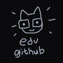

       
    
    

        <a href="https://edvintually.xyz"> <b> edvintually.xyz </b> </a> github page
    

a personal website for edvintually.
 
this website is actively being worked on, forgive me for any bugs and lack of support for various devices / resolutions.

homepage, contacts, and error 404 page completed so far.
 
bio, portfolio, resource, and miscellaneous page planned for the future.

portfolio would include showcases of my art, animation, video effects, and music.
 
resources would include sample packs, and hopefully project files and video game mods down the line.
 
miscellaneous would include a gallery of stuff made for the website, credits, and a special thanks section.

## change logs

### october 19, 2024 (v0)
day one of learning html + css. website started development.

### october 27, 2024 (v0.1)
homepage, contact, and 404 page at a publishable state, website on the internet using github pages

### october 28, 2024 (v0.11)
quality of life changes, added tab icon, added README.md, 

## credits // special thanks

### credits

- [edvintually](http://edvintually.xyz) - code, music, art

### special thanks

- [em](http://msx.horse), [nasso](http://nasso.dev) - heavy website inspiriation
- hex, ronnie, jerm - being dope friends
- everyone in swagcord + the hole